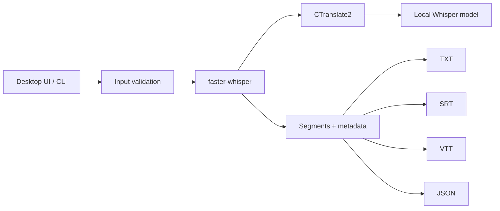

# Gentill Transcriber

[**Português (Brasil)**](README.pt-BR.md) · **English**

> Offline audio and video transcription with local Whisper inference, privacy-first execution and a verified desktop release pipeline.

**Search / technologies:** audio transcription, video transcription, speech-to-text, ASR, Whisper offline, faster-whisper, CTranslate2, Python desktop app, Windows, local AI, private transcription, SRT subtitles, VTT subtitles, PyInstaller.

[](https://github.com/viniciusvilaverd-22/GENTILL_TRANSCRIBER/actions/workflows/windows-ci.yml)

**Gentill Transcriber** is a Python desktop application that turns audio and video into text without sending media to a cloud transcription API. It uses `faster-whisper` + CTranslate2 with a local model and exports TXT, JSON, SRT and VTT.

> PT-BR: transcrição local de áudio e vídeo com foco em privacidade, uso offline e um processo de release verificável.

## Technologies and search terms

Python · faster-whisper · OpenAI Whisper-compatible models · CTranslate2 · Tkinter/ttk · PyInstaller · PyAV · GitHub Actions · Windows desktop · offline speech recognition · speech-to-text · audio transcription · video transcription · subtitles · SRT · VTT · JSON · local AI · privacy.

Portuguese search terms: **transcrição de áudio**, **transcrição de vídeo**, **transcrição offline**, **Whisper offline**, **IA local**, **reconhecimento de voz**, **legendas SRT**, **legendas VTT**, **programa de transcrição para Windows**.

## Why this project matters

This repository is not only a GUI around Whisper. It covers the full path from inference code to a validated desktop artifact:

- local model loading with `local_files_only=True`;
- Tkinter/ttk desktop interface with background processing;
- TXT, JSON, SRT and VTT exporters;
- PyInstaller packaging for Windows and macOS preparation;
- dependency compatibility gates;
- packaged executable E2E transcription;
- Windows PE icon validation;
- SHA-256 release manifest;
- RC → release promotion only after QA passes.

## Download

Windows release candidate:

- [Gentill Transcriber v0.3.0-rc1](https://github.com/viniciusvilaverd-22/GENTILL_TRANSCRIBER/releases/tag/v0.3.0-rc1)
- [Windows ZIP](https://github.com/viniciusvilaverd-22/GENTILL_TRANSCRIBER/releases/download/v0.3.0-rc1/Gentill-Transcriber-Windows-v0.3.0-rc1.zip)
- [Release manifest](https://github.com/viniciusvilaverd-22/GENTILL_TRANSCRIBER/releases/download/v0.3.0-rc1/RELEASE_MANIFEST_windows.json)

Release archive SHA-256:

`25b6ab459d9a0f45f65f1699c215e89883e08075fbfcfdd0356d1a6704b145c9`

The release was built and verified by GitHub Actions before publication.

## Current status

**Version:** `0.3.0-rc1`

| Gate | Windows |
| --- | --- |
| Unit tests | PASS |
| Real media E2E in Python runtime | PASS |
| Packaged executable startup | PASS |
| Packaged executable transcription | PASS |
| TXT / JSON / SRT / VTT output | PASS |
| Offline policy | PASS |
| Windows icon resources | PASS |
| Release manifest | PASS |

Validated Windows executable SHA-256:

`64cba27e2535457962aa4f3da1b0ed86ae66c8944570e22e2790aeafc9d85243`

The validated binary is intentionally not committed to the Git repository. The source contains the reproducible build and verification pipeline.

## Architecture



The runtime transcription path does not require a cloud API. The model is loaded from disk and implicit model downloads are disabled.

## Supported media

Audio: WAV, MP3, M4A, AAC, FLAC, OGG and OPUS.

Video: MP4, MKV, MOV, WEBM and AVI.

## Development setup

Recommended baseline: Python 3.12.

```powershell
python -m venv .venv
.venv\Scripts\python.exe -m pip install -r requirements.in -r requirements-runtime-compat.txt -r requirements-build.txt
```

Provision a compatible local CTranslate2 Whisper model at:

```text
models/whisper-small-ct2/
```

The model files are intentionally excluded from Git.

Run the tests:

```powershell
.venv\Scripts\python.exe -m unittest -v test_transcriber.py test_transcriber_e2e.py
```

Run the source GUI:

```powershell
.venv\Scripts\pythonw.exe transcriber_gui.py
```

## Windows build

```text
build_windows.cmd
```

The Windows pipeline:

1. generates the application icon;
2. installs the pinned runtime/build compatibility dependencies;
3. runs unit + E2E gates;
4. builds an onedir PyInstaller RC;
5. launches the executable;
6. transcribes a generated WAV through the packaged executable;
7. validates `RT_ICON` / `RT_GROUP_ICON`;
8. creates a SHA-256 release manifest;
9. promotes the RC to `dist` only after every gate passes.

Final executable:

```text
dist/Gentill Transcriber/Gentill Transcriber.exe
```

## CI and releases

`.github/workflows/windows-ci.yml` runs lightweight compatibility and unit gates on Windows without downloading the large model.

`.github/workflows/release-windows.yml` is prepared to build a full Windows bundle and create a GitHub Release when a `v*` tag is pushed.

## Engineering notes

The project includes a concrete packaging/debugging case study: a previous executable contained a PyAV build whose `av.open()` signature was incompatible with the `metadata_errors` argument used by `faster-whisper`. Source-level tests alone did not catch it. The release process was changed to pin a compatible PyAV version and execute a real transcription through the final packaged EXE.

See [docs/engineering-notes.md](docs/engineering-notes.md).

## Privacy

- audio/video is processed locally;
- no transcription API key is required;
- model loading uses `local_files_only=True`;
- input media, generated transcriptions, models, virtual environments and release bundles are excluded from Git.

See [docs/privacy.md](docs/privacy.md).

## Project structure

```text
transcriber.py                 # inference + exporters + CLI
transcriber_gui.py             # desktop application
test_transcriber.py            # exporter/unit tests
test_transcriber_e2e.py        # compatibility + real media tests
gentill_transcriber.spec       # PyInstaller definition
verify_release.py              # packaged EXE, model, E2E and PE verification
generate_icon.py               # deterministic multi-size Windows icon
promote_windows_release.py     # validated RC promotion with rollback
build_windows.cmd              # Windows build pipeline
build_macos.command            # macOS build pipeline
docs/                          # architecture, privacy and engineering notes
.github/workflows/             # CI and release automation
```

## Roadmap

- drag-and-drop and batch queue;
- local history;
- speaker diarization;
- performance benchmarks;
- clean-Windows validation;
- installer and code signing;
- native macOS validation and notarization.

## Author

**Vinícius Vilaverde** + **Gentill Ops**

GitHub: https://github.com/viniciusvilaverd-22/GENTILL_TRANSCRIBER

The application also includes an optional Pix contribution shortcut in its About screen.

## License

A redistribution license has not yet been selected. Until a license is added, normal copyright restrictions apply.
