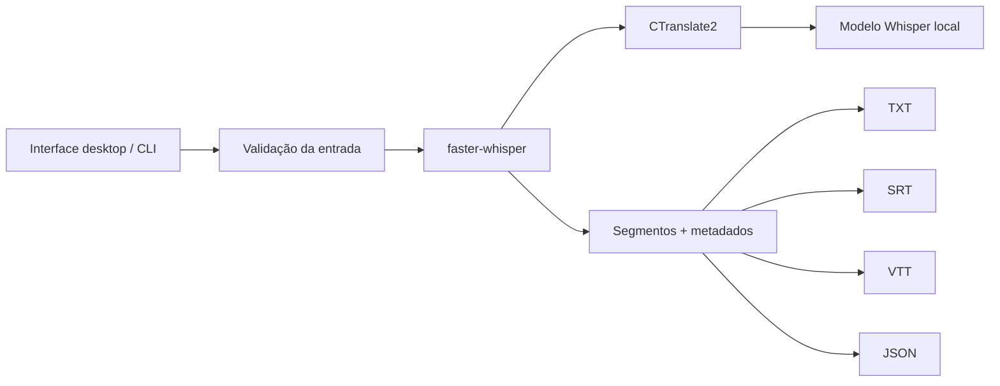

# Gentill Transcriber

**Português (Brasil)** · [English](README.md)

> Aplicativo desktop para **transcrição de áudio e vídeo offline**, usando Whisper local, com foco em privacidade e um processo de release verificável.

[](https://github.com/viniciusvilaverd-22/GENTILL_TRANSCRIBER/actions/workflows/windows-ci.yml)

O **Gentill Transcriber** transforma áudio e vídeo em texto sem enviar a mídia para uma API de transcrição em nuvem. O motor usa `faster-whisper` + CTranslate2 com modelo local e exporta **TXT, JSON, SRT e VTT**.

**Termos de busca / tecnologias:** transcrição de áudio, transcrição de vídeo, speech-to-text, reconhecimento de voz, ASR, Whisper offline, faster-whisper, CTranslate2, Python, aplicativo desktop, Windows, IA local, transcrição privada, legendas SRT, legendas VTT, PyInstaller.

## Download para Windows

Release candidate pública:

- [Gentill Transcriber v0.3.0-rc1](https://github.com/viniciusvilaverd-22/GENTILL_TRANSCRIBER/releases/tag/v0.3.0-rc1)
- [Baixar ZIP para Windows](https://github.com/viniciusvilaverd-22/GENTILL_TRANSCRIBER/releases/download/v0.3.0-rc1/Gentill-Transcriber-Windows-v0.3.0-rc1.zip)
- [Manifesto da release](https://github.com/viniciusvilaverd-22/GENTILL_TRANSCRIBER/releases/download/v0.3.0-rc1/RELEASE_MANIFEST_windows.json)

SHA-256 do ZIP publicado:

`25b6ab459d9a0f45f65f1699c215e89883e08075fbfcfdd0356d1a6704b145c9`

A release é compilada e validada pelo GitHub Actions antes da publicação.

## O que o projeto demonstra

O objetivo não é apenas criar uma interface para Whisper. O projeto cobre o caminho completo entre código-fonte e aplicativo desktop verificável:

- carregamento de modelo local com `local_files_only=True`;
- interface desktop em Tkinter/ttk;
- processamento em background para não travar a janela;
- exportação TXT, JSON, SRT e VTT;
- empacotamento com PyInstaller;
- controle de compatibilidade de dependências;
- teste E2E executado pelo próprio `.exe`;
- validação do ícone PE do Windows;
- manifesto de release com SHA-256;
- CI no GitHub Actions;
- promoção RC → release somente após todos os gates passarem.

## Tecnologias

| Área | Tecnologia |
| --- | --- |
| Linguagem | Python 3.12 |
| IA / ASR | faster-whisper |
| Inferência | CTranslate2 |
| Interface | Tkinter / ttk |
| Mídia | PyAV |
| Build desktop | PyInstaller |
| CI/CD | GitHub Actions |
| Plataforma validada | Windows |
| Saídas | TXT, JSON, SRT, VTT |

Palavras-chave relacionadas: **speech recognition**, **speech-to-text**, **automatic speech recognition**, **Whisper local**, **transcrição offline**, **transcrição privada**, **gerador de legendas**, **transcrever MP3**, **transcrever WAV**, **transcrever MP4**, **transcrição sem nuvem**.

## Estado atual

**Versão:** `0.3.0-rc1`

| Gate | Windows |
| --- | --- |
| Testes unitários | PASS |
| E2E de mídia no runtime Python | PASS |
| Startup do executável empacotado | PASS |
| Transcrição pelo executável empacotado | PASS |
| TXT / JSON / SRT / VTT | PASS |
| Política offline | PASS |
| Recursos de ícone do Windows | PASS |
| Manifesto de release | PASS |
| GitHub Actions CI | PASS |

SHA-256 do executável Windows validado localmente:

`64cba27e2535457962aa4f3da1b0ed86ae66c8944570e22e2790aeafc9d85243`

O binário não é commitado no repositório Git. O código contém o processo reproduzível de build e validação.

## Como funciona



O caminho normal de transcrição não depende de API de nuvem. O modelo é carregado do disco e downloads implícitos são desativados.

Leia também: [Arquitetura](docs/arquitetura.pt-BR.md).

## Formatos suportados

**Áudio:** WAV, MP3, M4A, AAC, FLAC, OGG e OPUS.

**Vídeo:** MP4, MKV, MOV, WEBM e AVI.

## Privacidade e uso offline

- áudio e vídeo são processados localmente;
- nenhuma chave de API de transcrição é necessária;
- o modelo é carregado com `local_files_only=True`;
- arquivos de entrada e transcrições permanecem no dispositivo;
- mídia, modelos, ambientes virtuais, builds e logs locais são excluídos do Git.

Leia: [Privacidade e comportamento offline](docs/privacidade.pt-BR.md).

## Instalação para desenvolvimento

Baseline recomendada: Python 3.12.

```powershell
python -m venv .venv
.venv\Scripts\python.exe -m pip install -r requirements.in -r requirements-runtime-compat.txt -r requirements-build.txt
```

O modelo local compatível deve ficar em:

```text
models/whisper-small-ct2/
```

Os pesos do modelo não são versionados no GitHub.

Executar testes:

```powershell
.venv\Scripts\python.exe -m unittest -v test_transcriber.py test_transcriber_e2e.py
```

Executar a interface a partir do código-fonte:

```powershell
.venv\Scripts\pythonw.exe transcriber_gui.py
```

## Build Windows

Execute:

```text
build_windows.cmd
```

O pipeline:

1. gera o ícone do aplicativo;
2. instala dependências compatíveis;
3. executa unit tests e E2E;
4. cria um RC com PyInstaller;
5. abre o executável empacotado;
6. transcreve um WAV pelo próprio executável;
7. valida `RT_ICON` e `RT_GROUP_ICON`;
8. gera manifesto SHA-256;
9. promove o RC para `dist` somente se todos os gates passarem.

Executável final:

```text
dist/Gentill Transcriber/Gentill Transcriber.exe
```

## Caso real de debugging

Durante a preparação do Windows foi encontrado um erro que só aparecia no aplicativo empacotado:

```text
open() got an unexpected keyword argument 'metadata_errors'
```

A causa era uma combinação incompatível do PyAV presente em um executável antigo. Testes no source passavam, mas o artefato final falhava.

A correção incluiu:

- pin de compatibilidade;
- teste direto de `av.open(..., metadata_errors="ignore")`;
- self-test no executável;
- transcrição E2E no `.exe` antes da promoção do release.

Leia o estudo: [Notas de engenharia](docs/notas-de-engenharia.pt-BR.md).

## Estrutura do projeto

```text
transcriber.py                 # inferência, exportadores e CLI
transcriber_gui.py             # aplicativo desktop
test_transcriber.py            # testes unitários
test_transcriber_e2e.py        # compatibilidade e E2E
gentill_transcriber.spec       # configuração PyInstaller
verify_release.py              # validação do executável, modelo, E2E e PE
generate_icon.py               # geração determinística do ícone
promote_windows_release.py     # promoção de RC com backup/rollback
build_windows.cmd              # pipeline Windows
build_macos.command            # pipeline preparado para macOS
docs/                          # documentação técnica
.github/workflows/             # CI e automação de release
```

## Roadmap

- arrastar e soltar arquivos;
- fila e processamento em lote;
- histórico local;
- diarização de falantes;
- benchmark de CPU/RAM/tempo;
- instalador Windows;
- assinatura Authenticode;
- validação nativa do macOS e notarização.

## Autoria

**Vinícius Vilaverde** + **Gentill Ops**

GitHub: https://github.com/viniciusvilaverd-22/GENTILL_TRANSCRIBER

O aplicativo também possui uma opção de contribuição via Pix na tela **Sobre**.

## Licença

Ainda não foi escolhida uma licença pública de redistribuição. Enquanto isso, aplicam-se as restrições normais de copyright.
