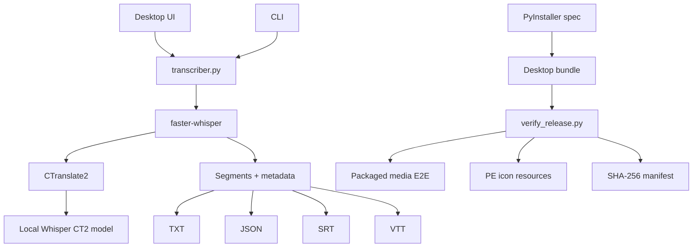

# Architecture

## Overview

Gentill Transcriber is split into three practical layers:

1. **Desktop/UI layer** — `transcriber_gui.py`
2. **Inference/export layer** — `transcriber.py`
3. **Packaging/release layer** — PyInstaller spec + verification scripts



## Inference boundary

The model is loaded using:

```python
WhisperModel(
    str(model_path),
    device=device,
    compute_type=compute_type,
    local_files_only=True,
)
```

The transcription runtime therefore expects a model already present on disk. Network provisioning belongs to setup/build, not to normal transcription.

## Threading

The GUI performs transcription on a background thread and reports completion/errors back to the Tk event loop through a queue. This prevents model inference from freezing the desktop window.

## Packaging

The Windows distribution is an **onedir** PyInstaller bundle. This avoids extracting a large model into a temporary directory on every launch.

The model is bundled as application data. Native dependencies from PyAV, CTranslate2 and related packages are collected by the PyInstaller spec.

## Release boundary

A candidate is not promoted merely because PyInstaller succeeds. `verify_release.py` validates the final bundle, including a real transcription executed by the packaged executable.
