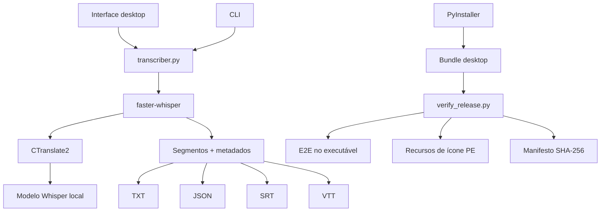

# Arquitetura — Gentill Transcriber

## Visão geral

O Gentill Transcriber é organizado em três camadas práticas:

1. **Interface desktop** — `transcriber_gui.py`
2. **Inferência e exportação** — `transcriber.py`
3. **Build e release** — PyInstaller + scripts de verificação

## Fronteira de inferência

O modelo é carregado usando `WhisperModel(..., local_files_only=True)`. A execução normal espera que o modelo já esteja disponível localmente; provisionamento de rede pertence ao setup/build, não ao caminho de transcrição.

## Interface e threading

A GUI realiza a transcrição em thread de background e envia resultados/erros de volta ao event loop do Tkinter por uma fila. Isso evita congelar a janela durante inferência.

## Empacotamento

No Windows o projeto usa PyInstaller em modo **onedir**. Isso evita extrair um modelo grande para diretório temporário a cada abertura.

## Fronteira de release

O projeto não considera um release válido apenas porque o PyInstaller terminou. O `verify_release.py` testa o bundle final, inclusive com uma transcrição real executada pelo próprio `.exe`.
